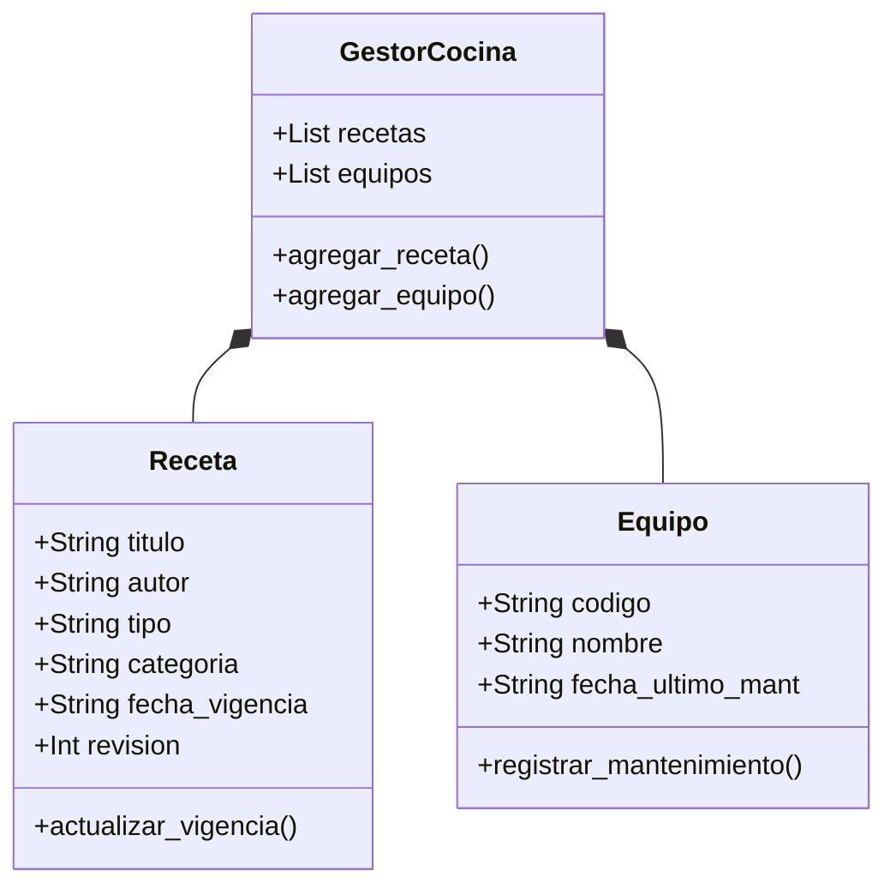

## 📊 Diagrama de Clases

```mermaid
classDiagram
    class Receta {
        +String titulo
        +String autor
        +String tipo
        +String categoria
        +String fecha_vigencia
        +Int revision
        +actualizar_vigencia()
    }
    class Equipo {
        +String codigo
        +String nombre
        +String fecha_ultimo_mant
        +registrar_mantenimiento()
    }
    class GestorCocina {
        +List recetas
        +List equipos
        +agregar_receta()
        +agregar_equipo()
    }
    GestorCocina *-- Receta
    GestorCocina *-- Equipo
```
